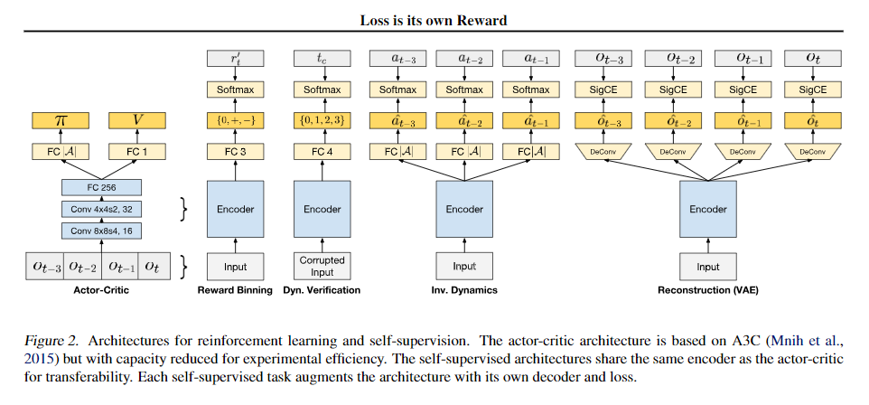
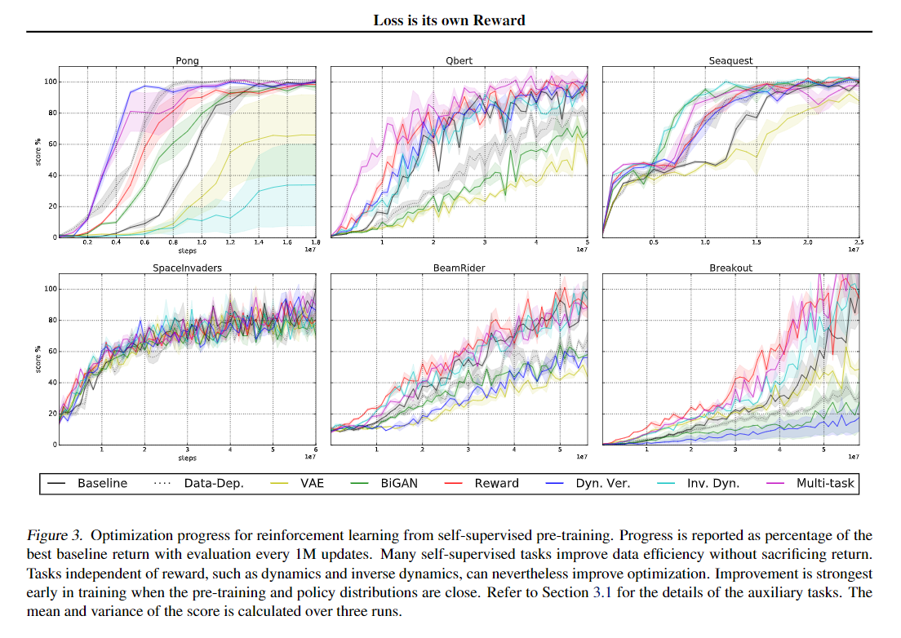
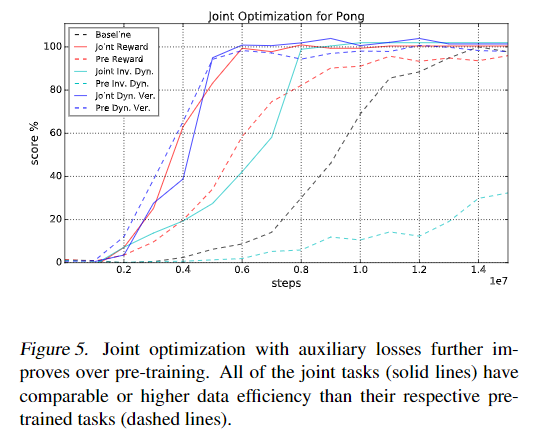

# Loss is its own Reward: Self-Supervision for Reinforcement Learning

## 算法

> [Loss is its own Reward:Self-Supervision for Reinforcement Learning](https://arxiv.org/abs/1612.07307)

强化学习优化了预期累积奖励的策略。但监督需要这么窄吗？对于许多任务来说，奖励是延迟和稀疏的，这使它成为端到端优化的一个困难和重要的信号。为了奖励，我们考虑一系列自我监督的任务，包括状态、行为和后继者，以提供辅助损失。这些损失为表征学习提供了无处不在的即时超视野，甚至在奖赏的意义上。虽然当前的结果表明仅从奖励中学习是可行的，但是纯增强学习方法受到计算和数据效率问题的限制，这些问题可以通过辅助损失来弥补。自我监督预训练和联合优化提高了端到端强化学习的数据效率和策略回报。

## 算法

### Self-Supervision

监督学习/无监督学习/自监督学习区别

### Tasks

#### Reward

奖励的自我监督是一种自然的选择用于微调RL的“表示”。通过回归分组为正，零和负类，可以将奖励转换为代理任务作为即时预测。这相当于一步或零折扣价值函数估计，因此对于价值方法来说可能是多余的。然而，即时预测任务的梯度噪声较小，因为它不受策略随机性或自举误差的影响。有了奖励，代理任务的准确性将与策略改进的程度密切相关。

#### Dynamics and Inverse Dynamics

这些任务的代理标签从转换中捕获状态，动作和后继 $$(s，a，s')$$ 关系。 即便是单一的转移也会影响动力学（后继者）和反动力学（行动）的损失。 损失不需要形成转移模型，简单的代理就足以帮助调整“表示”。 时间自我监督的难度可以通过时间步长的跨度和步幅来调整。

通过识别状态继承者 $$（s，s'）$$ 是否来自环境，Dynamics可以被转换为验证任务。我们的自我监督的动态验证任务是从 $$t_0$$ 到 $$t_k$$ 中识别出被破坏的观察结果 $$O_{t_{c}}$$ ，其中破坏的规则为交换 $$O_{t_{c}}$$和$$O_{t^{\prime}}$$ $$t^{\prime} \notin\left\{t_{0}, \dots, t_{k}\right\}$$ 。

Inverse dynamics，即映射 $$\mathcal{S} \times \mathcal{S} \rightarrow \mathcal{A}$$ ，我们的自我监督逆动力学任务是推断观察历史的干预行为。

#### Reconstruction

用于重建的代理标签简单的等同与输入和输出之间的距离损失。可以用VAE或者GAN实现。

在我们的方法中，自我监督的目的是代表性学习，而不是动态和回报的完整建模。 如这些代理任务所示，代理注释不需要直接预测转换和后退功能。 预计辅助损失将给予梯度，而不一定提供基于模型的生成模型RL。 虽然建模可能难以处理，但梯度可能足以改善强化学习。

### Loss as Intrinsic Reward

内在奖励旨在支持技能学习，帮助探索，或以其他方式指导政策改进。奖励将新颖性，好奇心和能力正式化，重点是学习进步和预测错误。自我监督的损失可以作为这种内在的回报，同时通过梯度调整表现来指导策略。

自我监督的内在回报可能导致策略转向更开放和更无知的探索状态。跟随损失可以访问仍然需要学习的转移，直到他们学习，然后继续前进。为了确保进步，回报学习进步可能是至关重要的，而不是绝对的损失。

## 实验

