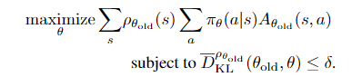
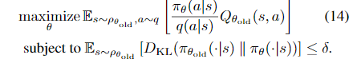
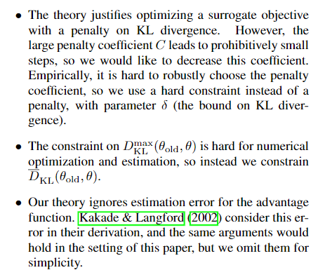

# TRPO

## 介绍

> [Trust Region Policy Optimization](https://arxiv.org/pdf/1502.05477.pdf)

我们描述了一个优化策略的迭代过程，保证了单调的改进。 通过对理论上合理的过程进行几次近似，我们开发了一种称为信任区域策略优化（TRPO）的实用算法。 该算法与自然策略梯度方法类似，对于优化大型非线性策略（如神经网络）是有效的。 我们的实验证明了它在各种任务中的强大性能：学习模拟机器人游泳，跳跃和步行步态; 并使用屏幕图像作为输入玩Atari游戏。 尽管它的近似值偏离了理论，但TRPO倾向于提供单调的改进，通过微调超参数。

## 算法

### 预备

定义期望折扣回报

$$\begin{array}{l}{\eta(\pi)=\mathbb{E}_{s 0, a_{0}, \ldots}\left[\sum_{t=0}^{\infty} \gamma^{t} r\left(s_{t}\right)\right], \text { where }} \\ {s_{0} \sim \rho_{0}\left(s_{0}\right), a_{t} \sim \pi\left(a_{t} | s_{t}\right), s_{t+1} \sim P\left(s_{t+1} | s_{t}, a_{t}\right)}\end{array}$$

定义价值函数、动作价值函数、动作优势价值函数

$$
\begin{array}{l}{Q_{\pi}\left(s_{t}, a_{t}\right)=\mathbb{E}_{s_{t+1}, a_{t+1}, \ldots}\left[\sum_{l=0}^{\infty} \gamma^{l} r\left(s_{t+l}\right)\right]} \\ {V_{\pi}\left(s_{t}\right)=\mathbb{E}_{a_{t}, s_{t+1}, \ldots}\left[\sum_{l=0}^{\infty} \gamma^{l} r\left(s_{t+l}\right)\right]} \\ {A_{\pi}(s, a)=Q_{\pi}(s, a)-V_{\pi}(s), \text { where }} \\ {a_{t} \sim \pi\left(a_{t} | s_{t}\right), s_{t+1} \sim P\left(s_{t+1} | s_{t}, a_{t}\right) \text { for } t \geq 0}\end{array}
$$

定义策略 $$\tilde{\pi}$$ 相对于策略 $$\pi$$ 的期望优势

$$\eta(\tilde{\pi})=\eta(\pi)+\mathbb{E}_{s_{0}, a_{0}, \cdots \sim \tilde{\pi}}\left[\sum_{t=0}^{\infty} \gamma^{t} A_{\pi}\left(s_{t}, a_{t}\right)\right]$$

即动作根据$$\tilde{\pi}$$采样，策略评估还是使用 $$\pi$$

令 $$\rho_{\pi}(s)=P\left(s_{0}=s\right)+\gamma P\left(s_{1}=s\right)+\gamma^{2} P\left(s_{2}=s\right)+\ldots$$ ，上式可写为

$$
\begin{aligned} \eta(\tilde{\pi}) &=\eta(\pi)+\sum_{t=0} \sum_{s} P\left(s_{t}=s | \tilde{\pi}\right) \sum_{a} \tilde{\pi}(a | s) \gamma^{t} A_{\pi}(s, a) \\ &=\eta(\pi)+\sum_{s} \sum_{t=0}^{\infty} \gamma^{t} P\left(s_{t}=s | \tilde{\pi}\right) \sum_{a} \tilde{\pi}(a | s) A_{\pi}(s, a) \\ &=\eta(\pi)+\sum_{s} \rho_{\tilde{\pi}}(s) \sum_{a} \tilde{\pi}(a | s) A_{\pi}(s, a) \end{aligned}
$$

这个式子表明只要能保证 $$\sum_{a} \tilde{\pi}(a | s) A_{\pi}(s, a) \geq 0$$ ，策略的期望回报就能增大。考虑策略迭代 $$\tilde{\pi}(s)=\arg \max _{a} A_{\pi}(s, a)$$ ，只要一个 $$A_\pi$$ 大于0，策略就会被提升，否则收敛。但是在近似的情况下，由于误差的存在，不可避免的有 $$\sum_{a} \tilde{\pi}(a | s) A_{\pi}(s, a)<0$$ 出现。为了简化问题我们提出了下面的近似公式：

$$
L_{\pi}(\tilde{\pi})=\eta(\pi)+\sum_{s} \rho_{\pi}(s) \sum_{a} \tilde{\pi}(a | s) A_{\pi}(s, a)
$$

注意这里使用的是 $$\rho_{\pi}(s)$$ 而不是 $$\rho_{\tilde{\pi}}(s)$$ ，即使用旧策略采样的状态频率。

因为 $$L_{\pi}$$ 与 $$\eta$$ 一阶匹配，则有梯度

$$
\begin{aligned} L_{\pi_{\theta_{0}}}\left(\pi_{\theta_{0}}\right) &=\eta\left(\pi_{\theta_{0}}\right) \\ \nabla_{\theta} L_{\pi_{\theta_{0}}}\left.\left(\pi_{\theta}\right)\right|_{\theta=\theta_{0}} &=\nabla_{\theta} \eta\left.\left(\pi_{\theta}\right)\right|_{\theta=\theta_{0}} \end{aligned}
$$

上式给出了一个增强策略的梯度方向，然而却没有指出合适的步长，为了解决这个问题我们采用新的思路：

令 $$\pi^{\prime}=\arg \max _{\pi^{\prime}} L_{\pi_{\mathrm{old}}}\left(\pi^{\prime}\right)$$ ，令新策略为 $$\pi_{\text { new }}(a | s)=(1-\alpha) \pi_{\text { old }}(a | s)+\alpha \pi^{\prime}(a | s)$$

根据 Kakade & Langford \(2002\) 等人的相关工作有下界关系：

$$\eta\left(\pi_{\text { new }}\right) \geq L_{\pi_{\text { old }}}\left(\pi_{\text { new }}\right)-\frac{2 \epsilon \gamma}{(1-\gamma)^{2}} \alpha^{2} \\ where\ \epsilon=\max _{s}\left|\mathbb{E}_{a \sim \pi^{\prime}(a | s)}\left[A_{\pi}(s, a)\right]\right|$$

我们只要让下界单调递增，则可实现策略的提升

### 一般随机策略的单调改进保证

我们用total variation divergence作为 $$\alpha$$ 的度量 ：

$$D_{\mathrm{TV}}^{\max }(\pi, \tilde{\pi})=\max _{s} D_{T V}(\pi(\cdot | s) \| \tilde{\pi}(\cdot | s))$$ ，有定理（证明见原文附录）

注意到其与KL散度的关系 $$D_{T V}(p \| q)^{2} \leq D_{\mathrm{KL}}(p \| q)$$ ，定理可写为

于是有如下算法，可以保证策略的单调递增

证明：令 $$M_{i}(\pi)=L_{\pi_{i}}(\pi)-C D_{\mathrm{KL}}^{\max }\left(\pi_{i}, \pi\right)$$ ，结合上式有

我们提出了算法1的近似算法Trust region policy optimization，其使用KL散度作为约束而不是惩罚项，以支持健壮的大步更新。

### 参数化策略的优化

我们把算法1的问题从

$$\underset{\theta}{\operatorname{maximize}}\left[L_{\theta_{\text { old }}}(\theta)-C D_{\mathrm{KL}}^{\max }\left(\theta_{\text { old }}, \theta\right)\right]$$

转换为带约束的最大化问题

$$\begin{array}{l}{\text { maximize } L_{\theta_{\text { old }}}(\theta)} \\ {\text { subject to } D_{\mathrm{KL}}^{\max }\left(\theta_{\text { old }}, \theta\right) \leq \delta}\end{array}$$

同时为了方便解决约束问题，我们用平均KL散度替换最大KL散度

$$\overline{D}_{\mathrm{KL}}^{\rho}\left(\theta_{1}, \theta_{2}\right) :=\mathbb{E}_{s \sim \rho}\left[D_{\mathrm{KL}}\left(\pi_{\theta_{1}}(\cdot | s) \| \pi_{\theta_{2}}(\cdot | s)\right]\right.$$

于是得到

$$\begin{array}{l}{\text { maximize } L_{\theta_{\text { old }}}(\theta)} \\ {\text { subject to } \overline{D}_{\mathrm{KL}}^{\rho \theta_{\text { old }}}\left(\theta_{\text { old }}, \theta\right) \leq \delta}\end{array}$$

### 基于采样的目标和约束估计

本节旨在用蒙特卡洛模拟近似上面的优化问题，展开 $$L_{\theta \text { old }}(\theta)$$

首先用 $$\frac{1}{1-\gamma} \mathbb{E}_{s \sim \rho_{\theta_{\text { old }}}}[\ldots]$$ 替换 $$\sum_{S} \rho_{\theta_{\text { old }}}(s)[\ldots]$$ ，然后用用 $$Q_{\theta_{\text { old }}}$$ 替换 $$A_{\theta_{\text { old }}}$$

最后用重要性采样处理动作求和

$$\sum_{a} \pi_{\theta}(a | s_{n}) A_{\theta_{\text { old }}}\left(s_{n}, a\right)=\mathbb{E}_{a \sim q}\left[\frac{\pi_{\theta}(a | s_{n})}{q(a | s_{n})} A_{\theta_{\text { old }}}\left(s_{n}, a\right)\right]$$

得到等价优化目标

剩下的就是用样本均值代替期望值，用经验估计代替Q值。以下部分描述了两种不同的方案来执行这种估计。

### 实际算法

通常可以分为三步

原文附录C给出了具体的优化算法

总结前面的内容

### 与前面工作的联系

使用L的线性近似和KL散度的二阶近似，自然梯度更新可以视为TRPO的特例

$$
\begin{array}{l}{\text { maximize }\left[\nabla_{\theta} L_{\theta_{\text { old }}}\left.(\theta)\right|_{\theta=\theta_{\text { old }}} \cdot\left(\theta-\theta_{\text { old }}\right)\right]} \\ {\text { subject to } \frac{1}{2}\left(\theta_{\text { old }}-\theta\right)^{T} A\left(\theta_{\text { old }}\right)\left(\theta_{\text { old }}-\theta\right) \leq \delta} \\ {\text { where } A\left(\theta_{\text { old }}\right)_{i j}=} \\ {\frac{\partial}{\partial \theta_{i}} \frac{\partial}{\partial \theta_{j}} \mathbb{E}_{s \sim \rho_{\pi}}\left.\left[D_{\mathrm{KL}}(\pi(\cdot | s, \theta_{\text { old }}) \| \pi(\cdot | s, \theta))\right]\right|_{\theta=\theta_{\text { old }}}}\end{array}
$$

更新式: $$\theta_{\text { new }}=\theta_{\text { old }}+\frac{1}{\lambda} A\left(\theta_{\text { old }}\right)^{-1} \nabla_{\theta} L\left.(\theta)\right|_{\theta=\theta_{\text { old }}}$$

## 实验

