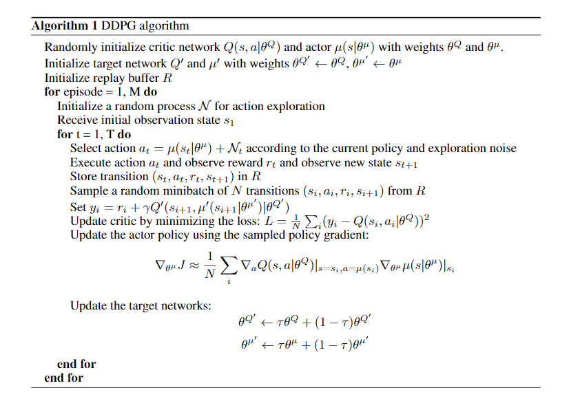
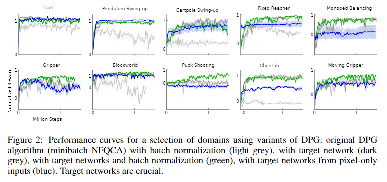

# DDPG

> [CONTINUOUS CONTROL WITH DEEP REINFORCEMENT LEARNING](https://arxiv.org/pdf/1509.02971.pdf)

我们将深度Q-Learning成功的基本思想适应于连续化的领域。 我们提出了一种基于可以在连续动作空间上操作的去终止策略梯度的演员评论，无模型算法。 使用相同的学习算法，网络架构和超参数，我们的算法可以有力地解决20多个模拟物理任务，包括经典问题，如推车摆动，灵巧操纵，腿式运动和汽车驾驶。 我们的算法能够找到性能与计划算法所发现的策略具有竞争性的策略，并且可以完全访问域及其衍生物的动态。 我们进一步证明，对于许多任务，算法可以“端对端”学习策略：直接来自原始像素输入。

## 方法

为了最大化回报，我们通常对期望回报函数进行微分，得到一个策略梯度来优化策略参数。

### 确定性策略梯度\(DPG\)

Silver 等人证明了确定性策略梯度定理

$$
\begin{aligned} \nabla_{\theta^{\mu}} J & \approx \mathbb{E}_{s_{t} \sim \rho^{\beta}}\left[\nabla_{\theta^{\mu}} Q\left.(s, a | \theta^{Q})\right|_{s=s_{t}, a=\mu\left(s_{t} | \theta^{\mu}\right)}\right] \\ &=\mathbb{E}_{s_{t} \sim \rho^{\beta}}\left[\nabla_{a} Q\left.(s, a | \theta^{Q})\right|_{s=s_{t}, a=\mu\left(s_{t}\right)} \nabla_{\theta_{\mu}} \mu\left.(s | \theta^{\mu})\right|_{s=s_{t}}\right] \end{aligned}
$$

其中 $$Q(s, a)$$ 是动作值函数， $$\mu(s)$$ 是连续动作函数，即Actor-Critic架构中的Critic和Actor。

用深度神经网络作为函数拟合器得到深度确定性梯度\(DDPG\)算法

其中 $$N_t$$ 是用于动作探索的噪音。和DQN一样，DDPG也有当前网络和目标网络之分，其中目标网络采用软更新的方式逐步复制当前网络的参数。Critic的学习和DQN一样使用时间差分算法，Actor则用确定性策略梯度定理来优化。最后，DDPG也用经验池来保证充分利用样本。

## 实验

文中提到用BNN可以提升训练的效果，然而Weight Normalization的论文提到BNN会使得DQN学习不稳定。在我的实验中，小BATCH\_SIZE情况下DDPG确实难以学到东西，毕竟DDPG的Critic部分和DQN类似。

