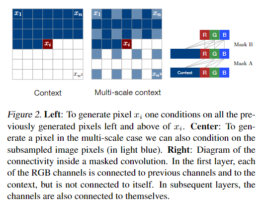

# Pixel Recurrent Neural Networks

## 介绍

> [Pixel Recurrent Neural Networks](https://arxiv.org/pdf/1601.06759.pdf)

对自然图像的分布进行建模是无监督学习中的一个里程碑问题。这项任务需要一个具有表现力，易处理性和可扩展性的图像模型。存在一个深度神经网络，它沿着两个空间维度依次预测图像中的像素。 我们的方法模拟原始像素值的离散概率，并对图像中的完整依赖关系进行编码。 架构新颖性包括快速二维循环层和深度循环网络中残余连接的有效使用。 我们在自然图像上实现了对数似然得分，这比以前的技术水平要好得多。 我们的主要结果还提供了各种ImageNet dataset的基准测试。 从模型生成的样本清晰，多样且全局一致

## 算法

### Model

我们的目标是估计自然图像的分布，这可以用来合理地计算图像的可能性并生成新的图像。 网络一次扫描一行图像，每行一次扫描一个像素。 对于每个像素，它预测给定扫描上下文的可能像素值的条件分布。图2说明了该过程。 对图像像素的联合分布被分解为条件分布的乘积。 预测中使用的参数与图像中的所有像素共享。

为了捕捉生成过程，Theis＆Bethge（2015）建议使用二维LSTM网络，该网络从左上角像素开始，向右下方像素。 LSTM网络的优势在于它有效地处理了对象和场景理解的核心的远程依赖性。 二维结构确保信号在从左到右和从上到下的方向上很好地传播。

#### Generating an Image Pixel by Pixel

目标是给每个 $$n×n$$ 像素的图像 $$x$$ 指定一个概率 $$p(\mathbf{x})$$ 。为了估计联合分布，我们把它写成像素上条件分布的乘积：

$$
p(\mathbf{x})=\prod_{i=1}^{n^{2}} p\left(x_{i} | x_{1}, \ldots, x_{i-1}\right) \ \ \ \ \ (1)
$$

每个像素依次由三个值共同确定，红色、绿色和蓝色通道各一个。我们将分布 $$p\left(x_{i} | \mathbf{x}<i\right)$$ 重写为以下乘积：

$$
p\left(x_{i, R} | \mathbf{x}_{<i}\right) p\left(x_{i, G} | \mathbf{x}_{<i}, x_{i, R}\right) p\left(x_{i, B} | \mathbf{x}_{<i}, x_{i, R}, x_{i, G}\right) \ \ \ \ (2)
$$

因此，每种颜色都取决于其他通道以及所有先前生成的像素。注意，在训练和评估期间，分布器并行地计算像素值，而图像的生成是顺序的。

#### Pixels as Discrete Variables

相比之下，我们建议将 $$p(x)$$ 建模为离散分布，方程2中的每个条件分布都是用 $$softmax$$ 层建模的多项式。 每个通道变量只需要256个不同的值。 离散分布代表性地简单，并且具有任意多模态的优点，而没有先前的形状。 实际上，我们还发现离散分布易于学习，并且与连续分布相比可以产生更好的性能。

### Pixel Recurrent Neural Networks

在本节中，我们将描述组成PixelRNN的架构组件

#### Row LSTM

Row LSTM是一个单向层，可以从上到下逐行处理图像，同时计算整行; 计算是用一维卷积进行的。 对于像素，该层捕获像素上方的大致三角形上下文，如图4（中心）所示。一维卷积的形状为 $$k \times 1$$ ，卷积中的权重共享确保沿每行的计算特征的平移不变性。

LSTM的计算方法如下：

$$\mathbf{x}_{i}$$ 的形状为 $$h \times n \times 1$$ ，是输入特征图的一行。圆圈里面的星号表示卷积，圆圈里面的点表示逐元素点乘。 $$\mathbf{K}^{s s} \text { and } \mathbf{K}^{i s}$$ 分别是state-to-state和input-to-state的权重参数。 $$\mathbf{o}_{i}, \mathbf{f}_{i}, \mathbf{i}_{i}, \mathbf{g}_{i}$$ 分别是输出门，遗忘门，输入门和输入内容。因为Row LSTM有一个三角形感受域\(图4 \)，所以它不能捕获整个可用的上下文。

#### Diagonal BiLSTM

Diagonal BiLSTM旨在实现计算的并行化并捕获整个可用的上下文图像大小。层的两个方向中的每一个以对角线方式对图像进行扫描，从顶部的角度开始并到达底部的对角。 计算中的每个步骤一次计算沿图像中对角线的LSTM状态。 图4（右）说明了计算和得到的感受野。

我们首先将输入图倾斜到一个空间，使其易于沿对角线应用卷积。倾斜操作相对于前一行将输入图的每一行偏移一个位置，如图3所示。此时，我们可以计算Diagonal BiLSTM的state-to-state和input-to-state的组件。或两个方向中的每一个，input-to-state组件是简单的1×1卷积，并贡献于LSTM核心中的四个门；该操作产生 $$4 h \times n \times n$$ 的张量。然后使用2×1的逐列的核 $$K^{s s}$$ 来计算state-to-state组件。该步骤采用先前的隐藏状态和单元状态，组合输入到状态分量的分量，并产生下一个隐藏状态和单元状态，如等式3中定义的。然后，通过移除偏移位置，输出图被倾斜回n×n。这种计算在两个方向上都重复进行。给定两个输出图，为了防止图层看到未来的像素，然后将right输出图向下移动一行并添加到左输出图上。

#### Residual Connections

为了处理深层网络，我们还考虑加入残差连接

#### Masked Convolution

网络中每一层的每个输入位置的 $$h$$ 特征被分成三个部分，每个部分对应一个RGB通道。当预测当前像素的R通道时，仅将生成的像素上面的生成的像素用作上下文。 当预测G通道时，除了先前生成的像素之外，R通道的值也可以用作上下文。同样，对于B通道，可以使用R和G通道的值。为了将网络中的连接限制在定义的依赖项上，我们将 $$mask$$ 应用于输入到状态卷积和像素网络中的其他卷积层。

我们使用两种类型的掩码：掩码A和掩码B，如图2（右）所示。掩码A仅应用于像素中的第一卷积层，并限制与那些相邻像素和当前像素中已经预测的那些颜色的连接。另一方面，掩码B应用于所有后续的输入到状态卷积转换，并通过允许从一种颜色到其自身的连接来放松掩码A的限制。

#### PixelCNN

行和对角线LSTM层在其感知域内具有可能未受限制的依赖性范围。这带来了计算成本，因为每个状态需要按顺序计算。 一个简单的解决方法是使感受野变大，但不是无界限。 我们可以使用标准卷积层来捕获有界接收场并计算所有像素位置的特征一次。PixelCNN使用多个卷积层来保持空间分辨率; 不使用池化层。 卷积中采用掩模以避免看到未来的环境。请注意，与PixelRNN相比，PixelCNN的并行化优势仅在训练期间或测试图像评估期间可用。对于这两种网络，图像生成过程是连续的，因为每个采样像素都需要作为输入到网络中。

#### Multi-Scale PixelRNN

多尺度PixelRNN由一个unconditional PixelRNN和一个或多个条件 PixelRNN组成。无条件网络首先用标准方法从原始图像中采样一个较小的 $$s \times s$$ 的图像。 然后条件网络将该图像作为附加输入并生成更大的 $$n×n$$ 的图像，如图2（中）所示。

## 实验

网络设置

我们所有的模型都是根据来自离散分布的对数似然损失函数进行训练和评估的。

评价指标为归一化的负的对数似然损失。

