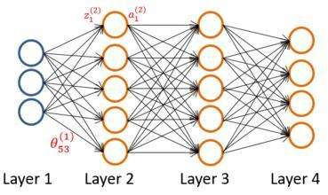
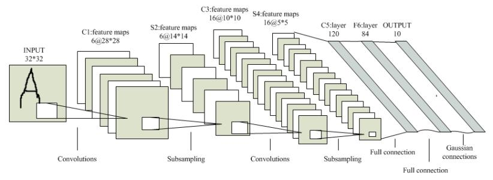

# 神经网络

人工神经网络（ANN）是一个通用的函数近似器，由其网络结构和每层权重定义。 由于它们具有通用性和能力来近似任何连续的实值函数（给出足够的参数），它们已被应用于各种任务，包括视频游戏。 这些AN的架构大致可分为两大类：前馈和递归神经网络（RNN）。前馈网络采用单个输入，例如，游戏状态的表示，并为每个可能的动作输出概率或值。

卷积神经网络（CNN）由可训练的卷积核组成，适用于处理图像数据，如来自视频游戏屏幕的像素。

RNN通常应用于时间序列数据，其中网络的输出可以取决于网络从先前的时间步长开始的活动。训练过程类似于前馈网络，只是网络的明显隐藏状态与下一个输入一起反馈到网络中。这允许网络通过记忆以前的激活来感知经济文本，当一个游戏的单一观察不能代表完整的游戏状态时，这很有用。对于视频游戏来说，通常使用一叠卷积层，然后是递归层和完全连接的前馈层。

